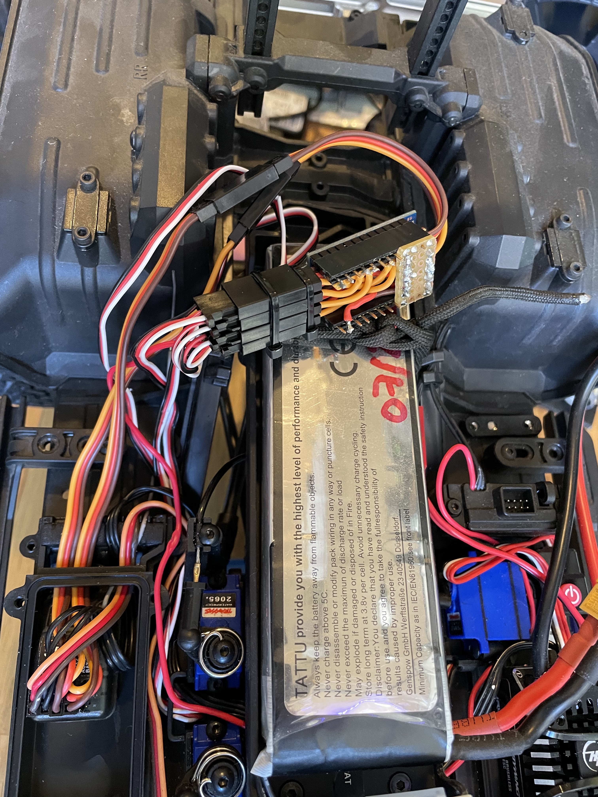

# Preamble

This is based on the works of [kelvineyeone](https://www.hackster.io/kelvineyeone) and his project at https://www.hackster.io/kelvineyeone/read-pwm-decode-rc-receiver-input-and-apply-fail-safe-6b90eb

# TRX 4 mixer

This is arudino based code for the pro micro to control gear, differentials and light with two channels

## Function

### Channel 1
Channel 1 is designed for a toggle switch on your remote, it activates on high PWM.

- short press: toggle low and high gear
- long press: toggle light
- double press: reset state (blick lights)

### Channel 2
Channel 2 is designed for a 3 way switch, each direction toggles the respetive differential.

### Other
On power up as well as on reset the lights blink, to confirm the controller is operational as well as visual feedback.

## Build

Designed and tested with a pro micro 5v/16MHz.
This is important as the interrupr hooks are mapped to the board but might work on others.

Open the arduino IDE change parameters as needed and upload to chip.

## Wiring

All wiring is configured in the trx4-mixer.ino as macros at the top of the file.

### Input

- PIN 8: PWM signal from receiver to control **gearing and light**
- PIN 9: PWM signal from receiver to control **front and back differentials**
- PIN 10: PWM signal from receiver to control winch. THIS needs extra hardware and is only a proof of concept

### Output

- PIN 3: control **the gearing** servo
- PIN 5: control **front differential** servo
- PIN 6: control **back differential** servo
- PIN 16: control **lights**

Note: light pin is simply setting the pin the HIGH as it is assumming you are running a Traxxas TRX8028

